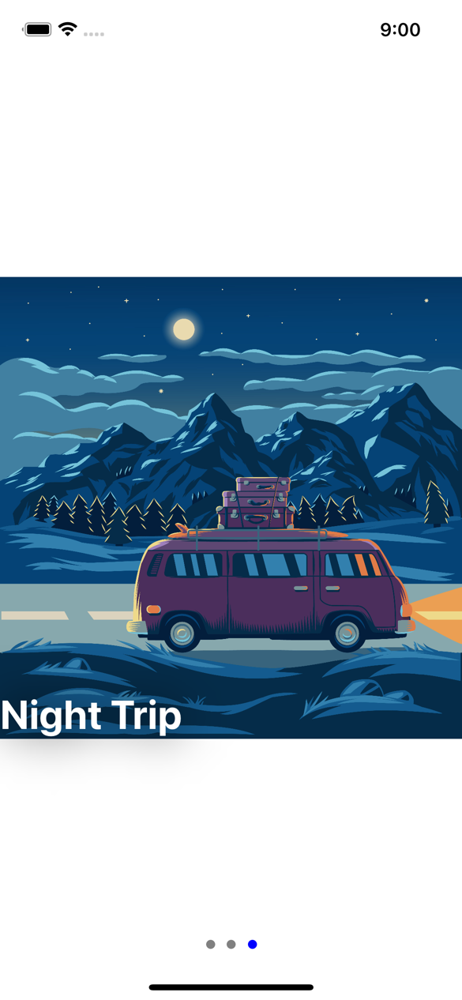

# SwiftUI-PageViewController
PageViewController in SwiftUI including dots page indicator!

As a consumer all you need to do is go to 'Consumer' group folder in Xcode, and there:

1.  Design your SwiftUI View inside 'PageViewContent' struct as you wish
2.  In 'ContentView' just call the PageSliderView supplying array of your implemented 'PageViewContent'

[Pre-Requisities: iOS 15 Xcode 13]

## License
MIT

## Sample

### Artwork

Images shown in slide were taken from https://www.freepik.com/

